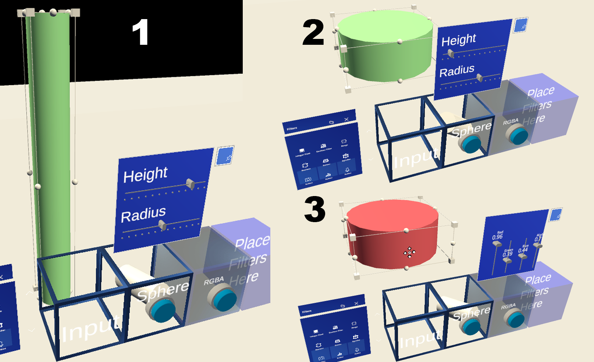

# MRTKonQuest2 - a 3D visualisation pipeline manipulator

This repo contains my thesis project.

An exploration to manipulate parameters of VTK data structures within a VR environment
### Link to thesis
```
https://www.overleaf.com/read/cdknqjhfrmtk
```



### Requirements

* Unity `2020.x.x` >= `2020.3.18`
* Oculus Quest 2 Build `34.0.0` or higher
* Windows 10
* Oculus Integration package `34.0`


### Installation

1. Clone or download this repository to your hard drive. In Windows 10, with [git](https://git-scm.com/download/win) installed, open a `git bash` terminal, navigate to your folder of choice and run

```bash
$ git clone https://gitlab.com/3dheart_public/vtktounity.git
```

2. Add project to Unity Hub and run with Unity version 2020.3.18

This gives compilation errors because the Oculus Provider is not included in git. Exit safemode.

3. Follow the MRTK configuration. 
    Apply > Next > Got it, next > Done


4. Install Oculus Integration package via Asset Store in Unity 

After installation the compilation errors should be gone. 

Click `no` on pop up request.

Click ``Dont upgrade`` when prompted fpr a new Audio Plugin Spatializer.

5. Run MainScene in Assets > Scenes > MainScene.unity

This can be done on the Oculus as well as the Game window. 

### Supported platforms, and Unity and VTK versions

* OS
	* Windows 10
* Unity
	* Release using Unity 2020.3.18f1
* VTK
	* N/A
* VR
	* Oculus Quest 2 OpenXR


